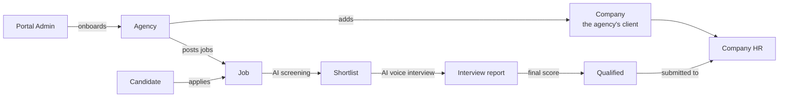
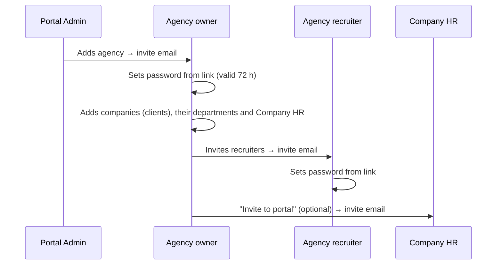
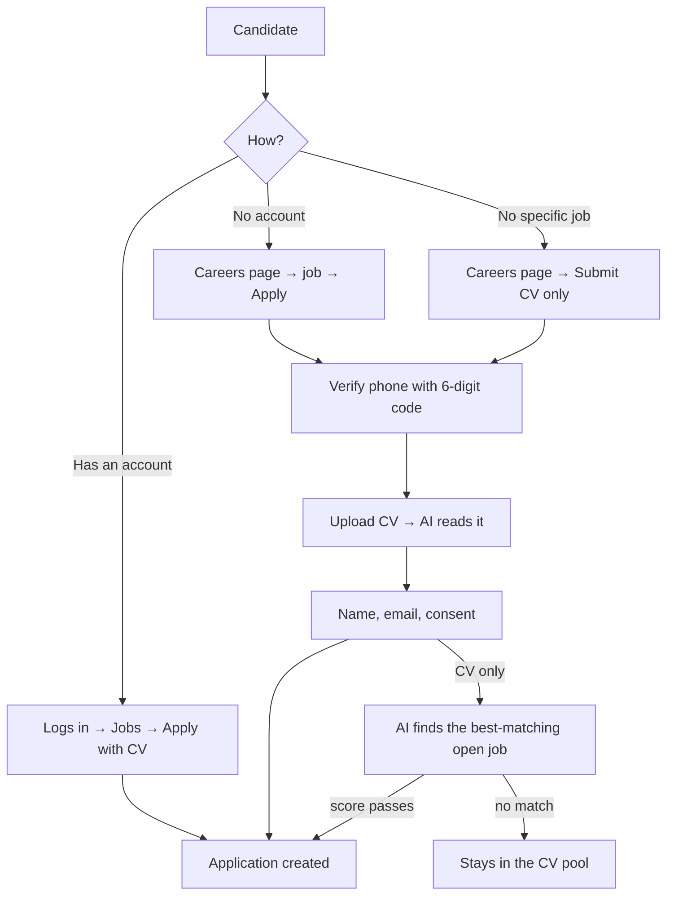
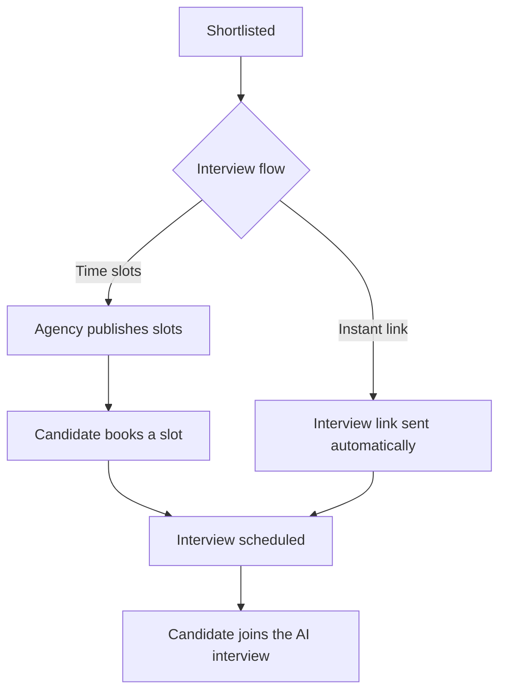
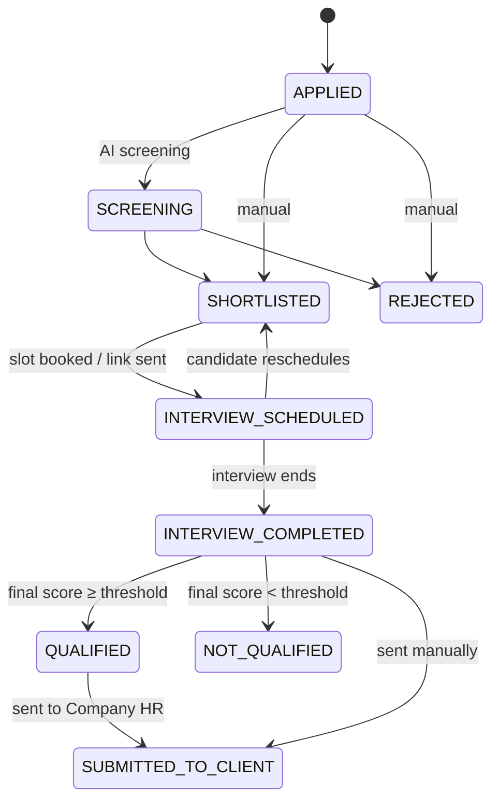

# RecruitIQ — System Flow

How RecruitIQ works from start to finish: who uses it, what each person does, and what the system does
automatically at each step. For setup, code structure and API details, see [README.md](README.md).

---

## 1. The big picture

RecruitIQ is used by **recruitment agencies**. An agency hires on behalf of its **client companies**.

In one sentence: **an agency posts a job → candidates apply → AI screens their CVs → shortlisted
candidates take an AI voice interview → the best are submitted to the client company's HR.**

---

## 2. Who uses the system

| Person | Shown in the app as | Signs in at | What they do |
| --- | --- | --- | --- |
| Platform owner | **Portal Admin** | `/admin` | Adds agencies, suspends or reactivates them, manages all users |
| Agency owner | **Agency** | `/company` | Everything inside their agency: jobs, candidates, interviews, companies, recruiters |
| Agency staff | **Agency recruiter** | `/company` | Only the jobs/companies assigned to them, with only the permissions the owner gave |
| Agency's client | **Company** | — (no login) | A record the agency keeps: name, contacts, departments |
| Client's hiring contact | **Company HR** | `/client` | Sees the candidates the agency sent them (view only), can ask for a second interview |
| Job seeker | **Candidate** | `/candidate`, or no login at all | Applies, tracks status, books and takes the interview |

### Recruiter permissions

The agency owner ticks what each recruiter may do:

| Permission | Allows |
| --- | --- |
| View candidates *(default for new recruiters)* | See applicants, scores, interview results and CVs — no actions |
| Review candidates | Run screening, shortlist / reject, second interviews |
| Manage jobs | Create, edit and close jobs |
| Configure interviews | AI interviewer settings, interview slots, interview links |
| Manage recruiters | Invite recruiters, set their permissions and job assignments |
| Manage clients | Companies, departments and Company HR |
| Submit candidates | Send qualified candidates to Company HR |

A recruiter only ever sees jobs assigned to them, jobs they created, and jobs of companies assigned to
them. They can't change their own access or assignments.

---

## 3. Getting set up

1. **Portal Admin adds an agency** (`/admin/companies/new`). The owner gets an email with a one-time
   link to set their password. Agencies can also self-register at `/auth/register` unless the admin has
   turned that off.
2. **The agency adds its client companies** (Companies → Add company): name, industry, website, contact
   person, email, phone, address.
3. For each company, the agency adds **Company HR** (name, email, phone, designation) and, optionally,
   **departments** as labels (IT, Finance…).
4. **The agency invites recruiters** (Agency recruiters → Invite), picks their permissions and jobs.
5. **Company HR can be invited to the portal**, or are invited automatically the first time a candidate
   is submitted to them.
6. **The careers page**: every agency gets a public careers page at `/careers/<agency-name>` that lists
   its open jobs. The link can be renamed from the dashboard.

Forgot your password? `/auth/forgot-password` emails a reset link valid for 1 hour.

---

## 4. The hiring journey

### Step 1 — Create a job

**Who:** Agency owner or a recruiter with *Manage jobs*. **Where:** Jobs → Create a job.

1. Enter a **title** and a **description**. Write everything you know in the description — skills,
   experience, education, location, work mode, salary, notice period, languages, certifications.
2. Optionally link the job to a **company** and its **Company HR** (who will receive candidates).
3. Click **Auto-fill details from description**: the AI reads the description and fills the "More
   details" fields. Anything you already set yourself is kept. Check the filled fields
   (marked *Filled from the description*) and change anything that's wrong.
4. Click **Publish job**. Any detail you never touched is still filled from the description on save, and
   the AI adds the required / preferred skills it finds.

After publishing, the job page lets you set:

| Setting | Where | What it does |
| --- | --- | --- |
| Minimum score | Applications → Screening settings | The bar a CV must reach (default 75) |
| Auto-reject below minimum | Applications → Screening settings | Rejects low scores automatically |
| Auto-advance on match | Applications → Screening settings | Screens on apply, shortlists or rejects automatically |
| Interview flow | Interviews → Interview flow | **Time slots** (book a time) or **Instant link** (start any time) |
| AI interviewer | Interviews → AI interviewer | Name, title, number of questions, answer time, custom questions, instructions, evaluation criteria |
| Final score | Final score settings | CV vs interview weight, pass threshold, auto-submit to Company HR |
| Assigned recruiters | Job page | Which recruiters work on this job |

### Step 2 — Candidates apply

There are three ways in:

- **Logged-in candidates** build a profile first (`/candidate/profile`): uploading a CV suggests profile
  and education details, which they review before saving.
- **Guests** don't need an account. They verify their phone with a 6-digit code (valid 5 minutes,
  5 tries), upload a CV, then give name, email and consent. An account is created for them and they get
  an email with a link to set a password later, plus a **personal status link**.
- If the email already belongs to an account, the guest must use the same phone that account has — or
  log in. Nobody can apply in someone else's name.
- **CV-only submissions**: the AI compares the CV with every open job, scores the top 3, and applies the
  candidate to the best one if it passes that job's minimum score. Otherwise the CV stays in the agency's
  **CV pool** (`/company/cv-pool`), where a recruiter can place it on a job by hand.

### Step 3 — AI screening

**Who:** Agency or a recruiter with *Review candidates*. **Where:** Job → Applications.

1. Click **Run AI Screening** (or it runs automatically on apply when *auto-advance* is on, and always for
   guest applications).
2. Each CV gets a **score out of 100**, built from:
   - fixed checks — skill overlap, years of experience, education match;
   - the AI's reading of the CV against the job.
3. The AI never sees the candidate's **name, gender or other personal details**.
4. Filter and sort the list by score, experience, skills, education and status.
5. Decide:
   - **Shortlist** or **Reject** one by one, in bulk, or with **Shortlist all screened**.
   - With *auto-reject*, scores below the minimum are rejected automatically.
   - With *auto-advance*, candidates are shortlisted or rejected on their score as soon as they apply.

Bulk actions skip candidates who already have an interview or later status.

Every shortlist or reject sends the candidate an email.

### Step 4 — Interview scheduling

What happens after a shortlist depends on the job's **interview flow**:

**Time slots** (default)
- The agency creates slots (Interviews → Create slot), or generates many at once with **Create AI
  Interview Slots** (e.g. 10:00–13:00 at 15 minutes → 12 slots). Slots can't be in the past.
- The candidate picks a slot on their application page — or, without logging in, from their status
  link. Two candidates can never book the same slot.
- The candidate can **reschedule** (cancel and pick another) until the interview starts.
- A confirmation email is sent on booking.

**Instant link**
- No booking: the candidate gets a personal link and can start the interview **any time before it
  expires** (default 7 days, set per job).
- When the job is switched to Instant link, **every candidate already shortlisted gets their link at
  once**. Anyone shortlisted later gets it the moment they are shortlisted.
- The link arrives by email and appears on the candidate's application page (**Join Interview**) and on
  their status page. If a link is ever missing, opening the application page creates it.
- The candidate (or the agency) can re-send it by email or SMS.

### Step 5 — The AI voice interview

**Who:** Candidate. **Where:** the interview room (from their application page or their link).

1. The candidate turns on camera and microphone. The camera is for presence only — **nothing is
   recorded**; only the transcript and events (camera off, tab switch, connection lost…) are kept.
2. The AI interviewer (e.g. "Priya – Virtual HR") speaks each question. The candidate answers out loud
   and presses Send. Each answer has a time limit.
3. The interview follows a **fixed order**: introduction → resume questions → basic technical →
   job-specific → scenario → behavioural → candidate's questions → end.
4. The AI only chooses the wording of questions (from the job, the CV and earlier answers) and whether
   one follow-up is needed. The order, number of questions and the end are fixed by the system.
5. **Difficulty adapts**: strong answers make the next question harder, weak ones easier, within the
   job's seniority level.
6. The agency's **custom questions** are always asked, and its **interview instructions** and
   **must-cover skills** steer the questions.
7. At the end the candidate can ask questions; the AI answers from the job description and company info
   only (never promises a result or salary), then closes the interview.

Voice runs through a separate worker service (`livekit-worker/`) using LiveKit and Deepgram.

### Step 6 — Interview report and final score

As soon as the interview ends, the system:

1. Writes the **interview report**: overall, technical and communication scores, strengths, concerns
   and a summary. If the agency set **evaluation criteria**, each one gets *Met / Partly met / Not met*
   with evidence. The full transcript is kept (raw and cleaned).
2. Calculates the **final score**: `CV score × CV weight + interview score × interview weight`
   (default 30% / 70%).
3. If the job has a **pass threshold**, the candidate becomes **Qualified** or **Not qualified**.
4. With *auto-submit* on, qualified candidates are sent to the job's Company HR automatically.

The agency reads everything on Job → Interviews → interview. Candidates see only that the interview is
complete — never their scores.

### Step 7 — Submit to the company

**Who:** Agency or a recruiter with *Submit candidates*. **Where:** the candidate's page → Submit to
company.

Only candidates who finished the interview (*Interview completed* or *Qualified*) can be submitted;
*Not qualified* candidates can't.

1. Preview the candidate package: contact details, CV match, interview summary and scores.
2. Send it to a Company HR (or any email) with an optional note.
3. The HR person gets an email with a **private link** to a read-only package (`/submission/<token>`)
   and the CV. Opening it marks the submission *Viewed*.
4. The candidate's status becomes **Submitted to client**. The submission history shows who sent what,
   when, and whether it was viewed.

### Step 8 — Company HR reviews

**Who:** Company HR. **Where:** `/client/candidates` (after accepting the portal invite).

1. They see **only** the candidates submitted to them — never other departments' or companies'.
2. Each candidate shows scores, the interview summary and the CV (view or download).
3. If they need more, they click **Request second round**.

### Step 9 — Second-round interview (optional)

1. Company HR (**Request second round**) or the agency (**Give second interview**) picks a reason
   (technical issue, not ready, need more detail, other) and adds notes.
2. The candidate gets a new instant interview link straight away; the agency is emailed when HR asks.
3. The notes steer the second interview's questions. Round 1 is kept.
4. The final score uses the latest round. At most 2 rounds per application.

---

## 5. Application statuses

| Status | Meaning | Candidate sees |
| --- | --- | --- |
| Applied | Application received | Applied |
| Screening | CV screened, waiting for a decision | Screening |
| Shortlisted | Passed — next is the interview | Shortlisted |
| Rejected | Not moving forward | Rejected |
| Interview scheduled | Slot booked or link sent | Interview scheduled |
| Interview completed | Interview done, report written | Interview completed |
| Qualified / Not qualified | Final score vs the job's threshold | Interview completed |
| Submitted to client | Sent to Company HR | Interview completed |

Interview statuses: **Scheduled → In progress → Completed** (or **Cancelled**).

---

## 6. Emails and messages

| When | Who gets it |
| --- | --- |
| Agency added / recruiter invited / Company HR invited | The new user — link to set a password (72 h) |
| Forgot password | The user — reset link (1 h) |
| Guest applies or submits a CV | Candidate — confirmation, status link, set-password link |
| Shortlisted or rejected | Candidate |
| Shortlisted on an instant-link job, or job switched to instant link | Candidate — interview link |
| Slot booked | Candidate — confirmation with date and time |
| Candidate submitted | Company HR — private link to the candidate package |
| Second round requested by Company HR | Agency |
| Second round created | Candidate — new interview link |
| Phone verification | Candidate — 6-digit code by SMS |

Emails go through Brevo; without it configured they are printed in the server log instead. SMS codes go
through Twilio, or are printed in the server log by default.

---

## 7. Without logging in

Candidates never have to create a password to get through the process:

- **Careers page** `/careers/<agency>` — browse and apply.
- **Status link** `/careers/track?token=…` (in every candidate email) — progress timeline, book / change
  / join a slot interview, open the instant interview link.
- **Interview link** `/interview/<token>` — start or resume the AI interview.

Company HR can likewise open submitted candidates from the emailed link without a portal account.

---

## 8. Safeguards built into the flow

- **Fair screening**: the AI never receives name, gender or other personal details; recruiter
  instructions that mention protected characteristics are removed before they reach the AI.
- **AI is never the only judge**: screening blends fixed checks with the AI; the interview order and
  length are fixed by the system.
- **No recordings**: camera and microphone are live only; no audio or video is stored.
- **Validated input everywhere**: every form checks its fields (names, emails, phone numbers with one
  leading `+`, websites must be `http(s)`, length limits, dates not in the past) in the browser and again
  on the server.
- **Private links**: invite, reset, interview and submission links are single-use or revocable; only
  their hashes are stored. Interview links only open that one interview.
- **Access control**: recruiters see only their assigned work; Company HR see only what was sent to
  them; suspended agencies and deactivated users can't sign in.
- **Race-safe booking**: a slot can only be booked once, and a candidate can't book two interviews.

---

## 9. Feature switches

Some parts of the flow are turned on per deployment in `.env`:

| Switch | Turns on |
| --- | --- |
| `ALLOW_COMPANY_SELF_REGISTER` | Agencies can sign up themselves (on by default) |
| `FEATURE_GUEST_APPLY` | Careers page, guest apply, CV-only submission |
| `FEATURE_INSTANT_INTERVIEW` | Instant interview links |
| `FEATURE_CLIENT_PORTAL` | Company HR portal logins |
| `DEMO_PAGE` | The `/live-demo` page with demo logins |

Everything else in this document is always on.
